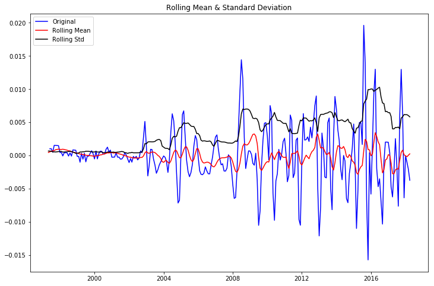

# Welcome to *Hold the Gold's* D.C. housing analysis presentation#

### The following analysis--by utilizing Zillow's extensive housing data--will examine the best real estate zip codes to invest in today.###


 


### **Goal:**

To find the top 3 zipcodes for our savvy investors to deploy capital into for maximum financial return.

### **Assumptions:**

1. You are an investor with a minimum of $100,000 to deploy upfront.
2. Your time horizon for investment is 5-10 years (this is not a liquid investment).
3. You seek to maximize growth potential by tapping into home value appreciation in one of America's fastest growing metro areas.
4.  Your threshold for volatility is low (note that no investment is guaranteed and any investment with *Hold the Gold* is subject to future market conditions).

### **Background:**

**Why the D.C. metropolitan area?**


max profit
min volatitily 
max potential for home value increase while rental income supplmentation
metro access 
upcoming fast growth trending area
heavy insulation from federal govenrment home
upcoming amazon headquarters
future growth oritented 
risk vs profitability
ROI yield

The DC area is home to numerous 10/10 GreatSchools Rated elementary, middle, and high schools
90-100	Most Competitive Redfin Compete Score
Most homes get multiple offers, often with waived contingencies.
Homes typically receive 1 offer.
Homes sell for around list price and go pending in around 11 days.
Hot Homes can sell for about 3% above list price and go pending in around 5 days.

walkscore.com
Washington D.C. is the 7th most walkable large city in the US with 601,723 residents.

Washington D.C. has excellent public transportation and is somewhat bikeable.77 walk score 71 transit score

### **Exploratory Data Analysis:**


```python
## first import all relevant libraries
%matplotlib inline 
import pandas as pd
import numpy as np
import matplotlib.pyplot as plt
import datetime
import seaborn as sns
import statsmodels.api as sm
from statsmodels.tsa.stattools import adfuller
from statsmodels.tsa.seasonal import seasonal_decompose

```


```python
## read in data
df=pd.read_csv("zillow_data.csv")
```


```python
## preview data
df.head()
```


<div>
<style scoped>
    .dataframe tbody tr th:only-of-type {
        vertical-align: middle;
    }

    .dataframe tbody tr th {
        vertical-align: top;
    }

    .dataframe thead th {
        text-align: right;
    }
</style>
<table border="1" class="dataframe">
  <thead>
    <tr style="text-align: right;">
      <th></th>
      <th>RegionID</th>
      <th>RegionName</th>
      <th>City</th>
      <th>State</th>
      <th>Metro</th>
      <th>CountyName</th>
      <th>SizeRank</th>
      <th>1996-04</th>
      <th>1996-05</th>
      <th>1996-06</th>
      <th>...</th>
      <th>2017-07</th>
      <th>2017-08</th>
      <th>2017-09</th>
      <th>2017-10</th>
      <th>2017-11</th>
      <th>2017-12</th>
      <th>2018-01</th>
      <th>2018-02</th>
      <th>2018-03</th>
      <th>2018-04</th>
    </tr>
  </thead>
  <tbody>
    <tr>
      <th>0</th>
      <td>84654</td>
      <td>60657</td>
      <td>Chicago</td>
      <td>IL</td>
      <td>Chicago</td>
      <td>Cook</td>
      <td>1</td>
      <td>334200.0</td>
      <td>335400.0</td>
      <td>336500.0</td>
      <td>...</td>
      <td>1005500</td>
      <td>1007500</td>
      <td>1007800</td>
      <td>1009600</td>
      <td>1013300</td>
      <td>1018700</td>
      <td>1024400</td>
      <td>1030700</td>
      <td>1033800</td>
      <td>1030600</td>
    </tr>
    <tr>
      <th>1</th>
      <td>90668</td>
      <td>75070</td>
      <td>McKinney</td>
      <td>TX</td>
      <td>Dallas-Fort Worth</td>
      <td>Collin</td>
      <td>2</td>
      <td>235700.0</td>
      <td>236900.0</td>
      <td>236700.0</td>
      <td>...</td>
      <td>308000</td>
      <td>310000</td>
      <td>312500</td>
      <td>314100</td>
      <td>315000</td>
      <td>316600</td>
      <td>318100</td>
      <td>319600</td>
      <td>321100</td>
      <td>321800</td>
    </tr>
    <tr>
      <th>2</th>
      <td>91982</td>
      <td>77494</td>
      <td>Katy</td>
      <td>TX</td>
      <td>Houston</td>
      <td>Harris</td>
      <td>3</td>
      <td>210400.0</td>
      <td>212200.0</td>
      <td>212200.0</td>
      <td>...</td>
      <td>321000</td>
      <td>320600</td>
      <td>320200</td>
      <td>320400</td>
      <td>320800</td>
      <td>321200</td>
      <td>321200</td>
      <td>323000</td>
      <td>326900</td>
      <td>329900</td>
    </tr>
    <tr>
      <th>3</th>
      <td>84616</td>
      <td>60614</td>
      <td>Chicago</td>
      <td>IL</td>
      <td>Chicago</td>
      <td>Cook</td>
      <td>4</td>
      <td>498100.0</td>
      <td>500900.0</td>
      <td>503100.0</td>
      <td>...</td>
      <td>1289800</td>
      <td>1287700</td>
      <td>1287400</td>
      <td>1291500</td>
      <td>1296600</td>
      <td>1299000</td>
      <td>1302700</td>
      <td>1306400</td>
      <td>1308500</td>
      <td>1307000</td>
    </tr>
    <tr>
      <th>4</th>
      <td>93144</td>
      <td>79936</td>
      <td>El Paso</td>
      <td>TX</td>
      <td>El Paso</td>
      <td>El Paso</td>
      <td>5</td>
      <td>77300.0</td>
      <td>77300.0</td>
      <td>77300.0</td>
      <td>...</td>
      <td>119100</td>
      <td>119400</td>
      <td>120000</td>
      <td>120300</td>
      <td>120300</td>
      <td>120300</td>
      <td>120300</td>
      <td>120500</td>
      <td>121000</td>
      <td>121500</td>
    </tr>
  </tbody>
</table>
<p>5 rows × 272 columns</p>
</div>


```python
## select only data from D.C. area
df_dc=df[df["State"]=="DC"]
```


```python
## drop unneeded columns
## dropped RegionID, City, State, Metro, CountyName
df_dc=df_dc.drop(["RegionID", "City", "State", "Metro", "CountyName", "SizeRank"], axis=1)
```


```python
##Rename RegionID to zipcode
df_dc.rename(columns={'RegionName': 'Zipcode'}, inplace=True)
df_dc.head()
```


<div>
<style scoped>
    .dataframe tbody tr th:only-of-type {
        vertical-align: middle;
    }

    .dataframe tbody tr th {
        vertical-align: top;
    }

    .dataframe thead th {
        text-align: right;
    }
</style>
<table border="1" class="dataframe">
  <thead>
    <tr style="text-align: right;">
      <th></th>
      <th>Zipcode</th>
      <th>1996-04</th>
      <th>1996-05</th>
      <th>1996-06</th>
      <th>1996-07</th>
      <th>1996-08</th>
      <th>1996-09</th>
      <th>1996-10</th>
      <th>1996-11</th>
      <th>1996-12</th>
      <th>...</th>
      <th>2017-07</th>
      <th>2017-08</th>
      <th>2017-09</th>
      <th>2017-10</th>
      <th>2017-11</th>
      <th>2017-12</th>
      <th>2018-01</th>
      <th>2018-02</th>
      <th>2018-03</th>
      <th>2018-04</th>
    </tr>
  </thead>
  <tbody>
    <tr>
      <th>29</th>
      <td>20002</td>
      <td>94300.0</td>
      <td>94000.0</td>
      <td>93700.0</td>
      <td>93600.0</td>
      <td>93400.0</td>
      <td>93400.0</td>
      <td>93400.0</td>
      <td>93600.0</td>
      <td>94000.0</td>
      <td>...</td>
      <td>662800</td>
      <td>668000</td>
      <td>672200</td>
      <td>673100</td>
      <td>674600</td>
      <td>678200</td>
      <td>680900</td>
      <td>683000</td>
      <td>687500</td>
      <td>691300</td>
    </tr>
    <tr>
      <th>33</th>
      <td>20009</td>
      <td>178800.0</td>
      <td>179200.0</td>
      <td>179600.0</td>
      <td>180000.0</td>
      <td>180300.0</td>
      <td>180700.0</td>
      <td>181200.0</td>
      <td>181800.0</td>
      <td>182600.0</td>
      <td>...</td>
      <td>1020000</td>
      <td>1027500</td>
      <td>1034300</td>
      <td>1040500</td>
      <td>1047400</td>
      <td>1055400</td>
      <td>1065900</td>
      <td>1076400</td>
      <td>1081000</td>
      <td>1078200</td>
    </tr>
    <tr>
      <th>181</th>
      <td>20011</td>
      <td>118900.0</td>
      <td>118500.0</td>
      <td>118200.0</td>
      <td>117800.0</td>
      <td>117600.0</td>
      <td>117400.0</td>
      <td>117400.0</td>
      <td>117500.0</td>
      <td>117800.0</td>
      <td>...</td>
      <td>582200</td>
      <td>586200</td>
      <td>591200</td>
      <td>593200</td>
      <td>591200</td>
      <td>589500</td>
      <td>590800</td>
      <td>599100</td>
      <td>611400</td>
      <td>619100</td>
    </tr>
    <tr>
      <th>246</th>
      <td>20019</td>
      <td>91300.0</td>
      <td>91000.0</td>
      <td>90600.0</td>
      <td>90400.0</td>
      <td>90100.0</td>
      <td>89900.0</td>
      <td>89700.0</td>
      <td>89600.0</td>
      <td>89600.0</td>
      <td>...</td>
      <td>291100</td>
      <td>296300</td>
      <td>302500</td>
      <td>306700</td>
      <td>308800</td>
      <td>310800</td>
      <td>313400</td>
      <td>314100</td>
      <td>311800</td>
      <td>308600</td>
    </tr>
    <tr>
      <th>258</th>
      <td>20001</td>
      <td>92000.0</td>
      <td>92600.0</td>
      <td>93200.0</td>
      <td>93900.0</td>
      <td>94600.0</td>
      <td>95400.0</td>
      <td>96100.0</td>
      <td>96800.0</td>
      <td>97700.0</td>
      <td>...</td>
      <td>765000</td>
      <td>768800</td>
      <td>771200</td>
      <td>773300</td>
      <td>777600</td>
      <td>780500</td>
      <td>781600</td>
      <td>785500</td>
      <td>791400</td>
      <td>793300</td>
    </tr>
  </tbody>
</table>
<p>5 rows × 266 columns</p>
</div>


```python
## Reset dataframe index and drop old index related to original zillow dataset
df_dc.reset_index(drop=True)
```


<div>
<style scoped>
    .dataframe tbody tr th:only-of-type {
        vertical-align: middle;
    }

    .dataframe tbody tr th {
        vertical-align: top;
    }

    .dataframe thead th {
        text-align: right;
    }
</style>
<table border="1" class="dataframe">
  <thead>
    <tr style="text-align: right;">
      <th></th>
      <th>Zipcode</th>
      <th>1996-04</th>
      <th>1996-05</th>
      <th>1996-06</th>
      <th>1996-07</th>
      <th>1996-08</th>
      <th>1996-09</th>
      <th>1996-10</th>
      <th>1996-11</th>
      <th>1996-12</th>
      <th>...</th>
      <th>2017-07</th>
      <th>2017-08</th>
      <th>2017-09</th>
      <th>2017-10</th>
      <th>2017-11</th>
      <th>2017-12</th>
      <th>2018-01</th>
      <th>2018-02</th>
      <th>2018-03</th>
      <th>2018-04</th>
    </tr>
  </thead>
  <tbody>
    <tr>
      <th>0</th>
      <td>20002</td>
      <td>94300.0</td>
      <td>94000.0</td>
      <td>93700.0</td>
      <td>93600.0</td>
      <td>93400.0</td>
      <td>93400.0</td>
      <td>93400.0</td>
      <td>93600.0</td>
      <td>94000.0</td>
      <td>...</td>
      <td>662800</td>
      <td>668000</td>
      <td>672200</td>
      <td>673100</td>
      <td>674600</td>
      <td>678200</td>
      <td>680900</td>
      <td>683000</td>
      <td>687500</td>
      <td>691300</td>
    </tr>
    <tr>
      <th>1</th>
      <td>20009</td>
      <td>178800.0</td>
      <td>179200.0</td>
      <td>179600.0</td>
      <td>180000.0</td>
      <td>180300.0</td>
      <td>180700.0</td>
      <td>181200.0</td>
      <td>181800.0</td>
      <td>182600.0</td>
      <td>...</td>
      <td>1020000</td>
      <td>1027500</td>
      <td>1034300</td>
      <td>1040500</td>
      <td>1047400</td>
      <td>1055400</td>
      <td>1065900</td>
      <td>1076400</td>
      <td>1081000</td>
      <td>1078200</td>
    </tr>
    <tr>
      <th>2</th>
      <td>20011</td>
      <td>118900.0</td>
      <td>118500.0</td>
      <td>118200.0</td>
      <td>117800.0</td>
      <td>117600.0</td>
      <td>117400.0</td>
      <td>117400.0</td>
      <td>117500.0</td>
      <td>117800.0</td>
      <td>...</td>
      <td>582200</td>
      <td>586200</td>
      <td>591200</td>
      <td>593200</td>
      <td>591200</td>
      <td>589500</td>
      <td>590800</td>
      <td>599100</td>
      <td>611400</td>
      <td>619100</td>
    </tr>
    <tr>
      <th>3</th>
      <td>20019</td>
      <td>91300.0</td>
      <td>91000.0</td>
      <td>90600.0</td>
      <td>90400.0</td>
      <td>90100.0</td>
      <td>89900.0</td>
      <td>89700.0</td>
      <td>89600.0</td>
      <td>89600.0</td>
      <td>...</td>
      <td>291100</td>
      <td>296300</td>
      <td>302500</td>
      <td>306700</td>
      <td>308800</td>
      <td>310800</td>
      <td>313400</td>
      <td>314100</td>
      <td>311800</td>
      <td>308600</td>
    </tr>
    <tr>
      <th>4</th>
      <td>20001</td>
      <td>92000.0</td>
      <td>92600.0</td>
      <td>93200.0</td>
      <td>93900.0</td>
      <td>94600.0</td>
      <td>95400.0</td>
      <td>96100.0</td>
      <td>96800.0</td>
      <td>97700.0</td>
      <td>...</td>
      <td>765000</td>
      <td>768800</td>
      <td>771200</td>
      <td>773300</td>
      <td>777600</td>
      <td>780500</td>
      <td>781600</td>
      <td>785500</td>
      <td>791400</td>
      <td>793300</td>
    </tr>
    <tr>
      <th>5</th>
      <td>20020</td>
      <td>104500.0</td>
      <td>103800.0</td>
      <td>103000.0</td>
      <td>102200.0</td>
      <td>101400.0</td>
      <td>100600.0</td>
      <td>100000.0</td>
      <td>99500.0</td>
      <td>99200.0</td>
      <td>...</td>
      <td>314700</td>
      <td>317600</td>
      <td>321800</td>
      <td>324500</td>
      <td>324800</td>
      <td>324900</td>
      <td>324900</td>
      <td>327300</td>
      <td>332800</td>
      <td>337000</td>
    </tr>
    <tr>
      <th>6</th>
      <td>20008</td>
      <td>450100.0</td>
      <td>448200.0</td>
      <td>446300.0</td>
      <td>444500.0</td>
      <td>442900.0</td>
      <td>441600.0</td>
      <td>440700.0</td>
      <td>440100.0</td>
      <td>440100.0</td>
      <td>...</td>
      <td>1501600</td>
      <td>1508800</td>
      <td>1509700</td>
      <td>1506000</td>
      <td>1509100</td>
      <td>1514300</td>
      <td>1519400</td>
      <td>1527900</td>
      <td>1539600</td>
      <td>1545900</td>
    </tr>
    <tr>
      <th>7</th>
      <td>20003</td>
      <td>130000.0</td>
      <td>130100.0</td>
      <td>130200.0</td>
      <td>130400.0</td>
      <td>130600.0</td>
      <td>130900.0</td>
      <td>131400.0</td>
      <td>131900.0</td>
      <td>132700.0</td>
      <td>...</td>
      <td>801000</td>
      <td>807200</td>
      <td>811900</td>
      <td>813400</td>
      <td>814600</td>
      <td>814600</td>
      <td>815300</td>
      <td>817300</td>
      <td>820200</td>
      <td>820200</td>
    </tr>
    <tr>
      <th>8</th>
      <td>20032</td>
      <td>85700.0</td>
      <td>85500.0</td>
      <td>85400.0</td>
      <td>85200.0</td>
      <td>85000.0</td>
      <td>84800.0</td>
      <td>84600.0</td>
      <td>84400.0</td>
      <td>84200.0</td>
      <td>...</td>
      <td>288100</td>
      <td>293400</td>
      <td>297800</td>
      <td>301500</td>
      <td>303700</td>
      <td>304000</td>
      <td>304600</td>
      <td>306800</td>
      <td>308200</td>
      <td>307400</td>
    </tr>
    <tr>
      <th>9</th>
      <td>20016</td>
      <td>362000.0</td>
      <td>361200.0</td>
      <td>360300.0</td>
      <td>359400.0</td>
      <td>358500.0</td>
      <td>357700.0</td>
      <td>357000.0</td>
      <td>356500.0</td>
      <td>356400.0</td>
      <td>...</td>
      <td>1202900</td>
      <td>1198700</td>
      <td>1196400</td>
      <td>1190400</td>
      <td>1184800</td>
      <td>1183600</td>
      <td>1186600</td>
      <td>1190000</td>
      <td>1196000</td>
      <td>1199500</td>
    </tr>
    <tr>
      <th>10</th>
      <td>20010</td>
      <td>110500.0</td>
      <td>111200.0</td>
      <td>112000.0</td>
      <td>112900.0</td>
      <td>113800.0</td>
      <td>114900.0</td>
      <td>116100.0</td>
      <td>117400.0</td>
      <td>118800.0</td>
      <td>...</td>
      <td>732800</td>
      <td>741700</td>
      <td>750900</td>
      <td>756300</td>
      <td>759300</td>
      <td>761800</td>
      <td>763500</td>
      <td>767800</td>
      <td>774700</td>
      <td>778200</td>
    </tr>
    <tr>
      <th>11</th>
      <td>20007</td>
      <td>358100.0</td>
      <td>356000.0</td>
      <td>353900.0</td>
      <td>351700.0</td>
      <td>349600.0</td>
      <td>347500.0</td>
      <td>345800.0</td>
      <td>344400.0</td>
      <td>343600.0</td>
      <td>...</td>
      <td>1329300</td>
      <td>1330800</td>
      <td>1324900</td>
      <td>1314100</td>
      <td>1303500</td>
      <td>1296500</td>
      <td>1293000</td>
      <td>1291200</td>
      <td>1291000</td>
      <td>1290000</td>
    </tr>
    <tr>
      <th>12</th>
      <td>20024</td>
      <td>209800.0</td>
      <td>208200.0</td>
      <td>206600.0</td>
      <td>205000.0</td>
      <td>203300.0</td>
      <td>201900.0</td>
      <td>200500.0</td>
      <td>199300.0</td>
      <td>198300.0</td>
      <td>...</td>
      <td>879200</td>
      <td>866900</td>
      <td>860100</td>
      <td>864500</td>
      <td>874100</td>
      <td>878200</td>
      <td>882300</td>
      <td>885500</td>
      <td>886900</td>
      <td>885000</td>
    </tr>
    <tr>
      <th>13</th>
      <td>20017</td>
      <td>121700.0</td>
      <td>121400.0</td>
      <td>121200.0</td>
      <td>121000.0</td>
      <td>120900.0</td>
      <td>120900.0</td>
      <td>121100.0</td>
      <td>121400.0</td>
      <td>121900.0</td>
      <td>...</td>
      <td>534300</td>
      <td>534300</td>
      <td>535300</td>
      <td>535600</td>
      <td>532600</td>
      <td>531000</td>
      <td>534400</td>
      <td>542300</td>
      <td>548400</td>
      <td>548900</td>
    </tr>
    <tr>
      <th>14</th>
      <td>20018</td>
      <td>123000.0</td>
      <td>122400.0</td>
      <td>121800.0</td>
      <td>121200.0</td>
      <td>120700.0</td>
      <td>120400.0</td>
      <td>120200.0</td>
      <td>120200.0</td>
      <td>120500.0</td>
      <td>...</td>
      <td>533200</td>
      <td>535200</td>
      <td>534700</td>
      <td>533100</td>
      <td>534500</td>
      <td>538700</td>
      <td>542200</td>
      <td>548300</td>
      <td>553800</td>
      <td>554100</td>
    </tr>
    <tr>
      <th>15</th>
      <td>20037</td>
      <td>277800.0</td>
      <td>275800.0</td>
      <td>273700.0</td>
      <td>271600.0</td>
      <td>269500.0</td>
      <td>267600.0</td>
      <td>265800.0</td>
      <td>264200.0</td>
      <td>263100.0</td>
      <td>...</td>
      <td>906400</td>
      <td>914900</td>
      <td>918700</td>
      <td>923400</td>
      <td>938900</td>
      <td>953100</td>
      <td>967600</td>
      <td>990100</td>
      <td>1013500</td>
      <td>1019600</td>
    </tr>
    <tr>
      <th>16</th>
      <td>20015</td>
      <td>312400.0</td>
      <td>311000.0</td>
      <td>309800.0</td>
      <td>308700.0</td>
      <td>307900.0</td>
      <td>307400.0</td>
      <td>307300.0</td>
      <td>307700.0</td>
      <td>308800.0</td>
      <td>...</td>
      <td>1000500</td>
      <td>1004000</td>
      <td>1005300</td>
      <td>1003700</td>
      <td>1002900</td>
      <td>1003600</td>
      <td>1004400</td>
      <td>1006400</td>
      <td>1007200</td>
      <td>1004000</td>
    </tr>
    <tr>
      <th>17</th>
      <td>20012</td>
      <td>185000.0</td>
      <td>184900.0</td>
      <td>184700.0</td>
      <td>184400.0</td>
      <td>184100.0</td>
      <td>183900.0</td>
      <td>183700.0</td>
      <td>183800.0</td>
      <td>184200.0</td>
      <td>...</td>
      <td>688500</td>
      <td>692000</td>
      <td>696100</td>
      <td>699400</td>
      <td>703800</td>
      <td>709400</td>
      <td>714400</td>
      <td>720100</td>
      <td>727400</td>
      <td>730700</td>
    </tr>
  </tbody>
</table>
<p>18 rows × 266 columns</p>
</div>


```python
##cast all zipcodes to string from integer
df_dc["Zipcode"]=df_dc["Zipcode"].astype(str)

```


```python
## transpose dates to rows
df_dc=df_dc.transpose()
df_dc.head()
```


<div>
<style scoped>
    .dataframe tbody tr th:only-of-type {
        vertical-align: middle;
    }

    .dataframe tbody tr th {
        vertical-align: top;
    }

    .dataframe thead th {
        text-align: right;
    }
</style>
<table border="1" class="dataframe">
  <thead>
    <tr style="text-align: right;">
      <th></th>
      <th>29</th>
      <th>33</th>
      <th>181</th>
      <th>246</th>
      <th>258</th>
      <th>402</th>
      <th>1263</th>
      <th>1448</th>
      <th>1707</th>
      <th>2066</th>
      <th>2581</th>
      <th>2653</th>
      <th>5297</th>
      <th>5339</th>
      <th>5453</th>
      <th>5805</th>
      <th>6484</th>
      <th>6887</th>
    </tr>
  </thead>
  <tbody>
    <tr>
      <th>Zipcode</th>
      <td>20002</td>
      <td>20009</td>
      <td>20011</td>
      <td>20019</td>
      <td>20001</td>
      <td>20020</td>
      <td>20008</td>
      <td>20003</td>
      <td>20032</td>
      <td>20016</td>
      <td>20010</td>
      <td>20007</td>
      <td>20024</td>
      <td>20017</td>
      <td>20018</td>
      <td>20037</td>
      <td>20015</td>
      <td>20012</td>
    </tr>
    <tr>
      <th>1996-04</th>
      <td>94300</td>
      <td>178800</td>
      <td>118900</td>
      <td>91300</td>
      <td>92000</td>
      <td>104500</td>
      <td>450100</td>
      <td>130000</td>
      <td>85700</td>
      <td>362000</td>
      <td>110500</td>
      <td>358100</td>
      <td>209800</td>
      <td>121700</td>
      <td>123000</td>
      <td>277800</td>
      <td>312400</td>
      <td>185000</td>
    </tr>
    <tr>
      <th>1996-05</th>
      <td>94000</td>
      <td>179200</td>
      <td>118500</td>
      <td>91000</td>
      <td>92600</td>
      <td>103800</td>
      <td>448200</td>
      <td>130100</td>
      <td>85500</td>
      <td>361200</td>
      <td>111200</td>
      <td>356000</td>
      <td>208200</td>
      <td>121400</td>
      <td>122400</td>
      <td>275800</td>
      <td>311000</td>
      <td>184900</td>
    </tr>
    <tr>
      <th>1996-06</th>
      <td>93700</td>
      <td>179600</td>
      <td>118200</td>
      <td>90600</td>
      <td>93200</td>
      <td>103000</td>
      <td>446300</td>
      <td>130200</td>
      <td>85400</td>
      <td>360300</td>
      <td>112000</td>
      <td>353900</td>
      <td>206600</td>
      <td>121200</td>
      <td>121800</td>
      <td>273700</td>
      <td>309800</td>
      <td>184700</td>
    </tr>
    <tr>
      <th>1996-07</th>
      <td>93600</td>
      <td>180000</td>
      <td>117800</td>
      <td>90400</td>
      <td>93900</td>
      <td>102200</td>
      <td>444500</td>
      <td>130400</td>
      <td>85200</td>
      <td>359400</td>
      <td>112900</td>
      <td>351700</td>
      <td>205000</td>
      <td>121000</td>
      <td>121200</td>
      <td>271600</td>
      <td>308700</td>
      <td>184400</td>
    </tr>
  </tbody>
</table>
</div>


```python
## Renaming all columns to reflect the 18 zipcodes of D.C.

new_header=df_dc.iloc[0] ##grab all first row data for the column headers
df_dc=df_dc[1:] ## take all rows after first row
df_dc.columns=new_header ## assign all column headers to be equal to row 0 data

```


```python
df_dc.head()
```


<div>
<style scoped>
    .dataframe tbody tr th:only-of-type {
        vertical-align: middle;
    }

    .dataframe tbody tr th {
        vertical-align: top;
    }

    .dataframe thead th {
        text-align: right;
    }
</style>
<table border="1" class="dataframe">
  <thead>
    <tr style="text-align: right;">
      <th>Zipcode</th>
      <th>20002</th>
      <th>20009</th>
      <th>20011</th>
      <th>20019</th>
      <th>20001</th>
      <th>20020</th>
      <th>20008</th>
      <th>20003</th>
      <th>20032</th>
      <th>20016</th>
      <th>20010</th>
      <th>20007</th>
      <th>20024</th>
      <th>20017</th>
      <th>20018</th>
      <th>20037</th>
      <th>20015</th>
      <th>20012</th>
    </tr>
  </thead>
  <tbody>
    <tr>
      <th>1996-04</th>
      <td>94300</td>
      <td>178800</td>
      <td>118900</td>
      <td>91300</td>
      <td>92000</td>
      <td>104500</td>
      <td>450100</td>
      <td>130000</td>
      <td>85700</td>
      <td>362000</td>
      <td>110500</td>
      <td>358100</td>
      <td>209800</td>
      <td>121700</td>
      <td>123000</td>
      <td>277800</td>
      <td>312400</td>
      <td>185000</td>
    </tr>
    <tr>
      <th>1996-05</th>
      <td>94000</td>
      <td>179200</td>
      <td>118500</td>
      <td>91000</td>
      <td>92600</td>
      <td>103800</td>
      <td>448200</td>
      <td>130100</td>
      <td>85500</td>
      <td>361200</td>
      <td>111200</td>
      <td>356000</td>
      <td>208200</td>
      <td>121400</td>
      <td>122400</td>
      <td>275800</td>
      <td>311000</td>
      <td>184900</td>
    </tr>
    <tr>
      <th>1996-06</th>
      <td>93700</td>
      <td>179600</td>
      <td>118200</td>
      <td>90600</td>
      <td>93200</td>
      <td>103000</td>
      <td>446300</td>
      <td>130200</td>
      <td>85400</td>
      <td>360300</td>
      <td>112000</td>
      <td>353900</td>
      <td>206600</td>
      <td>121200</td>
      <td>121800</td>
      <td>273700</td>
      <td>309800</td>
      <td>184700</td>
    </tr>
    <tr>
      <th>1996-07</th>
      <td>93600</td>
      <td>180000</td>
      <td>117800</td>
      <td>90400</td>
      <td>93900</td>
      <td>102200</td>
      <td>444500</td>
      <td>130400</td>
      <td>85200</td>
      <td>359400</td>
      <td>112900</td>
      <td>351700</td>
      <td>205000</td>
      <td>121000</td>
      <td>121200</td>
      <td>271600</td>
      <td>308700</td>
      <td>184400</td>
    </tr>
    <tr>
      <th>1996-08</th>
      <td>93400</td>
      <td>180300</td>
      <td>117600</td>
      <td>90100</td>
      <td>94600</td>
      <td>101400</td>
      <td>442900</td>
      <td>130600</td>
      <td>85000</td>
      <td>358500</td>
      <td>113800</td>
      <td>349600</td>
      <td>203300</td>
      <td>120900</td>
      <td>120700</td>
      <td>269500</td>
      <td>307900</td>
      <td>184100</td>
    </tr>
  </tbody>
</table>
</div>


```python
df_dc.index=pd.to_datetime(df_dc.index)
df_dc.info()
```

    <class 'pandas.core.frame.DataFrame'>
    DatetimeIndex: 265 entries, 1996-04-01 to 2018-04-01
    Data columns (total 18 columns):
    20002    265 non-null object
    20009    265 non-null object
    20011    265 non-null object
    20019    265 non-null object
    20001    265 non-null object
    20020    265 non-null object
    20008    265 non-null object
    20003    265 non-null object
    20032    265 non-null object
    20016    265 non-null object
    20010    265 non-null object
    20007    265 non-null object
    20024    265 non-null object
    20017    265 non-null object
    20018    265 non-null object
    20037    265 non-null object
    20015    265 non-null object
    20012    265 non-null object
    dtypes: object(18)
    memory usage: 39.3+ KB


```python
df_dc.reset_index()
df_dc.head()
```


<div>
<style scoped>
    .dataframe tbody tr th:only-of-type {
        vertical-align: middle;
    }

    .dataframe tbody tr th {
        vertical-align: top;
    }

    .dataframe thead th {
        text-align: right;
    }
</style>
<table border="1" class="dataframe">
  <thead>
    <tr style="text-align: right;">
      <th>Zipcode</th>
      <th>20002</th>
      <th>20009</th>
      <th>20011</th>
      <th>20019</th>
      <th>20001</th>
      <th>20020</th>
      <th>20008</th>
      <th>20003</th>
      <th>20032</th>
      <th>20016</th>
      <th>20010</th>
      <th>20007</th>
      <th>20024</th>
      <th>20017</th>
      <th>20018</th>
      <th>20037</th>
      <th>20015</th>
      <th>20012</th>
    </tr>
  </thead>
  <tbody>
    <tr>
      <th>1996-04-01</th>
      <td>94300</td>
      <td>178800</td>
      <td>118900</td>
      <td>91300</td>
      <td>92000</td>
      <td>104500</td>
      <td>450100</td>
      <td>130000</td>
      <td>85700</td>
      <td>362000</td>
      <td>110500</td>
      <td>358100</td>
      <td>209800</td>
      <td>121700</td>
      <td>123000</td>
      <td>277800</td>
      <td>312400</td>
      <td>185000</td>
    </tr>
    <tr>
      <th>1996-05-01</th>
      <td>94000</td>
      <td>179200</td>
      <td>118500</td>
      <td>91000</td>
      <td>92600</td>
      <td>103800</td>
      <td>448200</td>
      <td>130100</td>
      <td>85500</td>
      <td>361200</td>
      <td>111200</td>
      <td>356000</td>
      <td>208200</td>
      <td>121400</td>
      <td>122400</td>
      <td>275800</td>
      <td>311000</td>
      <td>184900</td>
    </tr>
    <tr>
      <th>1996-06-01</th>
      <td>93700</td>
      <td>179600</td>
      <td>118200</td>
      <td>90600</td>
      <td>93200</td>
      <td>103000</td>
      <td>446300</td>
      <td>130200</td>
      <td>85400</td>
      <td>360300</td>
      <td>112000</td>
      <td>353900</td>
      <td>206600</td>
      <td>121200</td>
      <td>121800</td>
      <td>273700</td>
      <td>309800</td>
      <td>184700</td>
    </tr>
    <tr>
      <th>1996-07-01</th>
      <td>93600</td>
      <td>180000</td>
      <td>117800</td>
      <td>90400</td>
      <td>93900</td>
      <td>102200</td>
      <td>444500</td>
      <td>130400</td>
      <td>85200</td>
      <td>359400</td>
      <td>112900</td>
      <td>351700</td>
      <td>205000</td>
      <td>121000</td>
      <td>121200</td>
      <td>271600</td>
      <td>308700</td>
      <td>184400</td>
    </tr>
    <tr>
      <th>1996-08-01</th>
      <td>93400</td>
      <td>180300</td>
      <td>117600</td>
      <td>90100</td>
      <td>94600</td>
      <td>101400</td>
      <td>442900</td>
      <td>130600</td>
      <td>85000</td>
      <td>358500</td>
      <td>113800</td>
      <td>349600</td>
      <td>203300</td>
      <td>120900</td>
      <td>120700</td>
      <td>269500</td>
      <td>307900</td>
      <td>184100</td>
    </tr>
  </tbody>
</table>
</div>


```python
## cast all prices from strings to integers
df_dc=df_dc.astype(int)

```

### Plotting Zipcode Trends:


```python
df_dc.plot(figsize=(17,8))
plt.title("Housing Price Trends ")
plt.xlabel('Year')
plt.ylabel('Home Price $')
##top 3 zip codes have consistently been top 3 performers for the last 20 years
## bottom 3 zipcodes display little change over time in price compared to top priced zip codes
## all zip codes display a similar trend with a an inflection point for the year 2008 (housing recession)

```


    Text(0, 0.5, 'Home Price $')


### Testing for Stationarity:


```python
#function to plot rolling mean and SD:
def test_stationarity(timeseries, window):
    
    #Defining rolling statistics
    rolmean = timeseries.rolling(window=window).mean()
    rolstd = timeseries.rolling(window=window).std()

    #Plot rolling statistics:
    fig = plt.figure(figsize=(12, 8))
    orig = plt.plot(timeseries.iloc[window:], color='blue',label='Original')
    mean = plt.plot(rolmean, color='red', label='Rolling Mean')
    std = plt.plot(rolstd, color='black', label = 'Rolling Std')
    plt.legend(loc='upper left')
    plt.title('Rolling Mean & Standard Deviation')
    plt.show()
    
```


```python
#call function to test the stationarity of the untransformed dataset; window = 22 years (full time range available)
test_stationarity(df_dc, 12)

##the assumption of stationarity is not met, as rolling mean is not constant over time

```


```python
df_dc.plot(figsize = (20,15), subplots=True, legend=True)
plt.show()
```


```python
df_dc.plot(figsize = (20,6), style = ".b")
import matplotlib.pyplot as plt
plt.show()
```


```python
def dickey_fuller_test_ind_zip(zip_code):
    dftest = adfuller(zip_code)

    # Extract and display test results in a user friendly manner
    dfoutput = pd.Series(dftest[0:4], index=['Test Statistic','p-value','#Lags Used','Number of Observations Used'])
    for key,value in dftest[4].items():
        dfoutput['Critical Value (%s)'%key] = value
    print(dftest)

    print ('Results of Dickey-Fuller Test:')

    print(dfoutput)
```


```python
def dickey_fuller_test_all_zip(df_dc):
    for col in df_dc.columns:
        dftest = adfuller(df_dc[col])
        dfoutput = pd.Series(dftest[0:4], index=['Test Statistic','p-value','#Lags Used','Number of Observations Used'])
#         for key,value in dftest[4].items():
#             dfoutput['Critical Value (%s)'%key] = value
        print(dftest)

        print ('Results of Dickey-Fuller Test:')
        print ('\n')
        print(dfoutput)    
```


```python
dickey_fuller_test_all_zip(df_dc)
```

    (-0.5461367553749569, 0.8826944742052973, 15, 249, {'1%': -3.4568881317725864, '5%': -2.8732185133016057, '10%': -2.5729936189738876}, 3920.545252411292)
    Results of Dickey-Fuller Test:
    
    
    Test Statistic                  -0.546137
    p-value                          0.882694
    #Lags Used                      15.000000
    Number of Observations Used    249.000000
    dtype: float64
    (-1.1189148131844875, 0.7074702578291568, 14, 250, {'1%': -3.456780859712, '5%': -2.8731715065600003, '10%': -2.572968544}, 4121.4250877836475)
    Results of Dickey-Fuller Test:
    
    
    Test Statistic                  -1.118915
    p-value                          0.707470
    #Lags Used                      14.000000
    Number of Observations Used    250.000000
    dtype: float64
    (-0.6378014655638256, 0.8622096679826863, 16, 248, {'1%': -3.4569962781990573, '5%': -2.8732659015936024, '10%': -2.573018897632674}, 3985.499935374562)
    Results of Dickey-Fuller Test:
    
    
    Test Statistic                  -0.637801
    p-value                          0.862210
    #Lags Used                      16.000000
    Number of Observations Used    248.000000
    dtype: float64
    (-1.783928143277446, 0.38846961035679833, 14, 250, {'1%': -3.456780859712, '5%': -2.8731715065600003, '10%': -2.572968544}, 3707.12143693434)
    Results of Dickey-Fuller Test:
    
    
    Test Statistic                  -1.783928
    p-value                          0.388470
    #Lags Used                      14.000000
    Number of Observations Used    250.000000
    dtype: float64
    (-0.7863232950406892, 0.8231065220249374, 13, 251, {'1%': -3.4566744514553016, '5%': -2.8731248767783426, '10%': -2.5729436702592023}, 4087.3255592934966)
    Results of Dickey-Fuller Test:
    
    
    Test Statistic                  -0.786323
    p-value                          0.823107
    #Lags Used                      13.000000
    Number of Observations Used    251.000000
    dtype: float64
    (-0.8510469518706897, 0.8036658555525436, 11, 253, {'1%': -3.4564641849494113, '5%': -2.873032730098417, '10%': -2.572894516864816}, 3886.6717815895763)
    Results of Dickey-Fuller Test:
    
    
    Test Statistic                  -0.851047
    p-value                          0.803666
    #Lags Used                      11.000000
    Number of Observations Used    253.000000
    dtype: float64
    (-2.1246519573586, 0.23471814510978506, 15, 249, {'1%': -3.4568881317725864, '5%': -2.8732185133016057, '10%': -2.5729936189738876}, 4604.50885324107)
    Results of Dickey-Fuller Test:
    
    
    Test Statistic                  -2.124652
    p-value                          0.234718
    #Lags Used                      15.000000
    Number of Observations Used    249.000000
    dtype: float64
    (-1.351554093376601, 0.6052689614445382, 14, 250, {'1%': -3.456780859712, '5%': -2.8731715065600003, '10%': -2.572968544}, 4015.436515742065)
    Results of Dickey-Fuller Test:
    
    
    Test Statistic                  -1.351554
    p-value                          0.605269
    #Lags Used                      14.000000
    Number of Observations Used    250.000000
    dtype: float64
    (-1.6606726131817435, 0.4514804598856628, 15, 249, {'1%': -3.4568881317725864, '5%': -2.8732185133016057, '10%': -2.5729936189738876}, 3854.570300542063)
    Results of Dickey-Fuller Test:
    
    
    Test Statistic                  -1.660673
    p-value                          0.451480
    #Lags Used                      15.000000
    Number of Observations Used    249.000000
    dtype: float64
    (-1.893209383580719, 0.33526234346022366, 16, 248, {'1%': -3.4569962781990573, '5%': -2.8732659015936024, '10%': -2.573018897632674}, 4162.106286545486)
    Results of Dickey-Fuller Test:
    
    
    Test Statistic                  -1.893209
    p-value                          0.335262
    #Lags Used                      16.000000
    Number of Observations Used    248.000000
    dtype: float64
    (-0.7829695413213618, 0.8240735226075573, 15, 249, {'1%': -3.4568881317725864, '5%': -2.8732185133016057, '10%': -2.5729936189738876}, 4062.1446310261886)
    Results of Dickey-Fuller Test:
    
    
    Test Statistic                  -0.782970
    p-value                          0.824074
    #Lags Used                      15.000000
    Number of Observations Used    249.000000
    dtype: float64
    (-2.5638865628678444, 0.10069322265750907, 15, 249, {'1%': -3.4568881317725864, '5%': -2.8732185133016057, '10%': -2.5729936189738876}, 4290.592655898537)
    Results of Dickey-Fuller Test:
    
    
    Test Statistic                  -2.563887
    p-value                          0.100693
    #Lags Used                      15.000000
    Number of Observations Used    249.000000
    dtype: float64
    (-1.1207233032741089, 0.7067373400486667, 15, 249, {'1%': -3.4568881317725864, '5%': -2.8732185133016057, '10%': -2.5729936189738876}, 4431.973326532635)
    Results of Dickey-Fuller Test:
    
    
    Test Statistic                  -1.120723
    p-value                          0.706737
    #Lags Used                      15.000000
    Number of Observations Used    249.000000
    dtype: float64
    (-1.0270059246675498, 0.7432875350502444, 14, 250, {'1%': -3.456780859712, '5%': -2.8731715065600003, '10%': -2.572968544}, 3918.9590569410925)
    Results of Dickey-Fuller Test:
    
    
    Test Statistic                  -1.027006
    p-value                          0.743288
    #Lags Used                      14.000000
    Number of Observations Used    250.000000
    dtype: float64
    (-1.367309827474695, 0.5978440314731485, 14, 250, {'1%': -3.456780859712, '5%': -2.8731715065600003, '10%': -2.572968544}, 3957.9708796315267)
    Results of Dickey-Fuller Test:
    
    
    Test Statistic                  -1.367310
    p-value                          0.597844
    #Lags Used                      14.000000
    Number of Observations Used    250.000000
    dtype: float64
    (-1.5877703821992597, 0.48973390196328087, 15, 249, {'1%': -3.4568881317725864, '5%': -2.8732185133016057, '10%': -2.5729936189738876}, 4475.32772592358)
    Results of Dickey-Fuller Test:
    
    
    Test Statistic                  -1.587770
    p-value                          0.489734
    #Lags Used                      15.000000
    Number of Observations Used    249.000000
    dtype: float64
    (-2.3368984183338486, 0.16034343125044997, 13, 251, {'1%': -3.4566744514553016, '5%': -2.8731248767783426, '10%': -2.5729436702592023}, 4072.020968218638)
    Results of Dickey-Fuller Test:
    
    
    Test Statistic                  -2.336898
    p-value                          0.160343
    #Lags Used                      13.000000
    Number of Observations Used    251.000000
    dtype: float64
    (-1.2407229603830006, 0.6558371166009613, 15, 249, {'1%': -3.4568881317725864, '5%': -2.8732185133016057, '10%': -2.5729936189738876}, 4055.559672390052)
    Results of Dickey-Fuller Test:
    
    
    Test Statistic                  -1.240723
    p-value                          0.655837
    #Lags Used                      15.000000
    Number of Observations Used    249.000000
    dtype: float64


### Detrending data:

## Group 1 Zip Codes: High Performance:  20008, 20007, 20016

#### Zip code 20008


```python
dickey_fuller_test_ind_zip(df_dc['20008'])
```

    (-2.1246519573586, 0.23471814510978506, 15, 249, {'1%': -3.4568881317725864, '5%': -2.8732185133016057, '10%': -2.5729936189738876}, 4604.50885324107)
    Results of Dickey-Fuller Test:
    Test Statistic                  -2.124652
    p-value                          0.234718
    #Lags Used                      15.000000
    Number of Observations Used    249.000000
    Critical Value (1%)             -3.456888
    Critical Value (5%)             -2.873219
    Critical Value (10%)            -2.572994
    dtype: float64


```python
test_stationarity(df_dc['20008'], 12)
```


```python
## Log transformation on zipcode 20008 and then perfomed Dickey_fuller test
##after transformation, p-value within critical range and can reject null hypothesis (stationry assumption met)
```


```python
#log transformation and dickey-fuller test for 20008 zip code
log_20008 = pd.Series(np.log(df_dc["20008"]))
dickey_fuller_test_ind_zip(log_20008)
```

    (-3.44412382463593, 0.00954356745494694, 15, 249, {'1%': -3.4568881317725864, '5%': -2.8732185133016057, '10%': -2.5729936189738876}, -2366.5978750425043)
    Results of Dickey-Fuller Test:
    Test Statistic                  -3.444124
    p-value                          0.009544
    #Lags Used                      15.000000
    Number of Observations Used    249.000000
    Critical Value (1%)             -3.456888
    Critical Value (5%)             -2.873219
    Critical Value (10%)            -2.572994
    dtype: float64


```python
#plot log transformation for 20008 zip code
fig = plt.figure(figsize=(12,6))
plt.plot(log_20008, color="blue")
plt.xlabel("month", fontsize=14)
plt.ylabel("log(monthly sales)", fontsize=14)
plt.show()
```


```python
test_stationarity(log_20008, 12)
```


```python
dickey_fuller_test_ind_zip(log_20008)
```

    (-3.44412382463593, 0.00954356745494694, 15, 249, {'1%': -3.4568881317725864, '5%': -2.8732185133016057, '10%': -2.5729936189738876}, -2366.5978750425043)
    Results of Dickey-Fuller Test:
    Test Statistic                  -3.444124
    p-value                          0.009544
    #Lags Used                      15.000000
    Number of Observations Used    249.000000
    Critical Value (1%)             -3.456888
    Critical Value (5%)             -2.873219
    Critical Value (10%)            -2.572994
    dtype: float64


## Group 2: High Medium Performing Zip codes:  20024, 20009, 20015, 20018, 20037

#### Zip code 20024: 


```python
test_stationarity(df_dc['20024'],12)
```


```python
dickey_fuller_test_ind_zip(df_dc['20024'])

```

    (-1.1207233032741089, 0.7067373400486667, 15, 249, {'1%': -3.4568881317725864, '5%': -2.8732185133016057, '10%': -2.5729936189738876}, 4431.973326532635)
    Results of Dickey-Fuller Test:
    Test Statistic                  -1.120723
    p-value                          0.706737
    #Lags Used                      15.000000
    Number of Observations Used    249.000000
    Critical Value (1%)             -3.456888
    Critical Value (5%)             -2.873219
    Critical Value (10%)            -2.572994
    dtype: float64


```python
transform_20024= np.log(df_dc['20024']).diff().diff()
```


```python
transform_20024.dropna(inplace=True)
```


```python
transform_20024.head()
```


    1996-06-01   -0.000059
    1996-07-01   -0.000060
    1996-08-01   -0.000553
    1996-09-01    0.001417
    1996-10-01   -0.000048
    Name: 20024, dtype: float64


```python
test_stationarity(transform_20024, 12)
```





```python
dickey_fuller_test_ind_zip(transform_20024)

```

    (-7.56980371999187, 2.8612220487957537e-11, 13, 249, {'1%': -3.4568881317725864, '5%': -2.8732185133016057, '10%': -2.5729936189738876}, -2203.9452901254763)
    Results of Dickey-Fuller Test:
    Test Statistic                -7.569804e+00
    p-value                        2.861222e-11
    #Lags Used                     1.300000e+01
    Number of Observations Used    2.490000e+02
    Critical Value (1%)           -3.456888e+00
    Critical Value (5%)           -2.873219e+00
    Critical Value (10%)          -2.572994e+00
    dtype: float64


## Group 3: Low Middle Performers:  20002, 20010, 20001, 20003, 200017,20012, 20011

#### Zip code 20002


```python
dickey_fuller_test_ind_zip(df_dc['20002'])
```

    (-0.5461367553749569, 0.8826944742052973, 15, 249, {'1%': -3.4568881317725864, '5%': -2.8732185133016057, '10%': -2.5729936189738876}, 3920.545252411292)
    Results of Dickey-Fuller Test:
    Test Statistic                  -0.546137
    p-value                          0.882694
    #Lags Used                      15.000000
    Number of Observations Used    249.000000
    Critical Value (1%)             -3.456888
    Critical Value (5%)             -2.873219
    Critical Value (10%)            -2.572994
    dtype: float64


```python
test_stationarity(df_dc['20002'], 12)
```


```python
transform_20002= np.log(df_dc['20002']).diff().diff()
```


```python
transform_20002.dropna(inplace=True)
```


```python
test_stationarity(transform_20002, 12)
```


```python
dickey_fuller_test_ind_zip(transform_20002)
```

    (-4.075268710551853, 0.0010638155911648214, 12, 250, {'1%': -3.456780859712, '5%': -2.8731715065600003, '10%': -2.572968544}, -2459.84049471383)
    Results of Dickey-Fuller Test:
    Test Statistic                  -4.075269
    p-value                          0.001064
    #Lags Used                      12.000000
    Number of Observations Used    250.000000
    Critical Value (1%)             -3.456781
    Critical Value (5%)             -2.873172
    Critical Value (10%)            -2.572969
    dtype: float64


## Low Performers:  20032, 20020, 20019

#### Zip code 20032:  


```python
dickey_fuller_test_ind_zip(df_dc['20032'])
```

    (-1.6606726131817435, 0.4514804598856628, 15, 249, {'1%': -3.4568881317725864, '5%': -2.8732185133016057, '10%': -2.5729936189738876}, 3854.570300542063)
    Results of Dickey-Fuller Test:
    Test Statistic                  -1.660673
    p-value                          0.451480
    #Lags Used                      15.000000
    Number of Observations Used    249.000000
    Critical Value (1%)             -3.456888
    Critical Value (5%)             -2.873219
    Critical Value (10%)            -2.572994
    dtype: float64


```python
test_stationarity(df_dc['20032'], 12)
```


```python
transform_20032= np.log(df_dc['20032']).diff().diff()
```


```python
transform_20032.dropna(inplace=True)
```


```python
transform_20032.head()
```


    1996-06-01    0.001166
    1996-07-01   -0.001174
    1996-08-01   -0.000006
    1996-09-01   -0.000006
    1996-10-01   -0.000006
    Name: 20032, dtype: float64


```python
test_stationarity(transform_20032,12)
```


```python
dickey_fuller_test_ind_zip(transform_20032)
```

    (-5.676570169441492, 8.67738969521844e-07, 13, 249, {'1%': -3.4568881317725864, '5%': -2.8732185133016057, '10%': -2.5729936189738876}, -2179.5784751300043)
    Results of Dickey-Fuller Test:
    Test Statistic                -5.676570e+00
    p-value                        8.677390e-07
    #Lags Used                     1.300000e+01
    Number of Observations Used    2.490000e+02
    Critical Value (1%)           -3.456888e+00
    Critical Value (5%)           -2.873219e+00
    Critical Value (10%)          -2.572994e+00
    dtype: float64


## Creating Final Dataset for Modeling


```python
df_dc_final4=df_dc.copy()
```


```python
df_dc_final4.head()
```


<div>
<style scoped>
    .dataframe tbody tr th:only-of-type {
        vertical-align: middle;
    }

    .dataframe tbody tr th {
        vertical-align: top;
    }

    .dataframe thead th {
        text-align: right;
    }
</style>
<table border="1" class="dataframe">
  <thead>
    <tr style="text-align: right;">
      <th>Zipcode</th>
      <th>20002</th>
      <th>20009</th>
      <th>20011</th>
      <th>20019</th>
      <th>20001</th>
      <th>20020</th>
      <th>20008</th>
      <th>20003</th>
      <th>20032</th>
      <th>20016</th>
      <th>20010</th>
      <th>20007</th>
      <th>20024</th>
      <th>20017</th>
      <th>20018</th>
      <th>20037</th>
      <th>20015</th>
      <th>20012</th>
    </tr>
  </thead>
  <tbody>
    <tr>
      <th>1996-04-01</th>
      <td>94300</td>
      <td>178800</td>
      <td>118900</td>
      <td>91300</td>
      <td>92000</td>
      <td>104500</td>
      <td>450100</td>
      <td>130000</td>
      <td>85700</td>
      <td>362000</td>
      <td>110500</td>
      <td>358100</td>
      <td>209800</td>
      <td>121700</td>
      <td>123000</td>
      <td>277800</td>
      <td>312400</td>
      <td>185000</td>
    </tr>
    <tr>
      <th>1996-05-01</th>
      <td>94000</td>
      <td>179200</td>
      <td>118500</td>
      <td>91000</td>
      <td>92600</td>
      <td>103800</td>
      <td>448200</td>
      <td>130100</td>
      <td>85500</td>
      <td>361200</td>
      <td>111200</td>
      <td>356000</td>
      <td>208200</td>
      <td>121400</td>
      <td>122400</td>
      <td>275800</td>
      <td>311000</td>
      <td>184900</td>
    </tr>
    <tr>
      <th>1996-06-01</th>
      <td>93700</td>
      <td>179600</td>
      <td>118200</td>
      <td>90600</td>
      <td>93200</td>
      <td>103000</td>
      <td>446300</td>
      <td>130200</td>
      <td>85400</td>
      <td>360300</td>
      <td>112000</td>
      <td>353900</td>
      <td>206600</td>
      <td>121200</td>
      <td>121800</td>
      <td>273700</td>
      <td>309800</td>
      <td>184700</td>
    </tr>
    <tr>
      <th>1996-07-01</th>
      <td>93600</td>
      <td>180000</td>
      <td>117800</td>
      <td>90400</td>
      <td>93900</td>
      <td>102200</td>
      <td>444500</td>
      <td>130400</td>
      <td>85200</td>
      <td>359400</td>
      <td>112900</td>
      <td>351700</td>
      <td>205000</td>
      <td>121000</td>
      <td>121200</td>
      <td>271600</td>
      <td>308700</td>
      <td>184400</td>
    </tr>
    <tr>
      <th>1996-08-01</th>
      <td>93400</td>
      <td>180300</td>
      <td>117600</td>
      <td>90100</td>
      <td>94600</td>
      <td>101400</td>
      <td>442900</td>
      <td>130600</td>
      <td>85000</td>
      <td>358500</td>
      <td>113800</td>
      <td>349600</td>
      <td>203300</td>
      <td>120900</td>
      <td>120700</td>
      <td>269500</td>
      <td>307900</td>
      <td>184100</td>
    </tr>
  </tbody>
</table>
</div>


```python
df_dc_final4=df_dc_final4[['20008','20024','20002','20032']]
df_dc_final4.head()
```


<div>
<style scoped>
    .dataframe tbody tr th:only-of-type {
        vertical-align: middle;
    }

    .dataframe tbody tr th {
        vertical-align: top;
    }

    .dataframe thead th {
        text-align: right;
    }
</style>
<table border="1" class="dataframe">
  <thead>
    <tr style="text-align: right;">
      <th>Zipcode</th>
      <th>20008</th>
      <th>20024</th>
      <th>20002</th>
      <th>20032</th>
    </tr>
  </thead>
  <tbody>
    <tr>
      <th>1996-04-01</th>
      <td>450100</td>
      <td>209800</td>
      <td>94300</td>
      <td>85700</td>
    </tr>
    <tr>
      <th>1996-05-01</th>
      <td>448200</td>
      <td>208200</td>
      <td>94000</td>
      <td>85500</td>
    </tr>
    <tr>
      <th>1996-06-01</th>
      <td>446300</td>
      <td>206600</td>
      <td>93700</td>
      <td>85400</td>
    </tr>
    <tr>
      <th>1996-07-01</th>
      <td>444500</td>
      <td>205000</td>
      <td>93600</td>
      <td>85200</td>
    </tr>
    <tr>
      <th>1996-08-01</th>
      <td>442900</td>
      <td>203300</td>
      <td>93400</td>
      <td>85000</td>
    </tr>
  </tbody>
</table>
</div>


```python
df_dc_final4['20008']=log_20008
df_dc_final4['20024']=transform_20024
df_dc_final4['20002']=transform_20002
df_dc_final4['20032']=transform_20032

df_dc_final4.dropna(inplace=True)
df_dc_final4.info()

```

    <class 'pandas.core.frame.DataFrame'>
    DatetimeIndex: 263 entries, 1996-06-01 to 2018-04-01
    Data columns (total 4 columns):
    20008    263 non-null float64
    20024    263 non-null float64
    20002    263 non-null float64
    20032    263 non-null float64
    dtypes: float64(4)
    memory usage: 10.3 KB


```python
df_dc_final4.to_csv("df_dc_final4.csv")
```

## ARIMA:


```python
!pip install pmdarima
```

    Requirement already satisfied: pmdarima in /anaconda3/lib/python3.7/site-packages (1.2.1)
    Requirement already satisfied: joblib>=0.11 in /anaconda3/lib/python3.7/site-packages (from pmdarima) (0.13.2)
    Requirement already satisfied: pandas>=0.19 in /anaconda3/lib/python3.7/site-packages (from pmdarima) (0.23.4)
    Requirement already satisfied: six>=1.5 in /anaconda3/lib/python3.7/site-packages (from pmdarima) (1.12.0)
    Requirement already satisfied: scipy<1.3,>=1.2 in /anaconda3/lib/python3.7/site-packages (from pmdarima) (1.2.2)
    Requirement already satisfied: Cython>=0.29 in /anaconda3/lib/python3.7/site-packages (from pmdarima) (0.29.2)
    Requirement already satisfied: statsmodels>=0.9.0 in /anaconda3/lib/python3.7/site-packages (from pmdarima) (0.9.0)
    Requirement already satisfied: scikit-learn>=0.19 in /anaconda3/lib/python3.7/site-packages (from pmdarima) (0.20.1)
    Requirement already satisfied: numpy>=1.15 in /anaconda3/lib/python3.7/site-packages (from pmdarima) (1.15.4)
    Requirement already satisfied: python-dateutil>=2.5.0 in /anaconda3/lib/python3.7/site-packages (from pandas>=0.19->pmdarima) (2.7.5)
    Requirement already satisfied: pytz>=2011k in /anaconda3/lib/python3.7/site-packages (from pandas>=0.19->pmdarima) (2018.7)


```python
# Load specific forecasting tools
from statsmodels.tsa.arima_model import ARMA,ARMAResults,ARIMA,ARIMAResults
from statsmodels.graphics.tsaplots import plot_acf,plot_pacf # for determining (p,q) orders
from statsmodels.tsa.stattools import adfuller
from statsmodels.graphics.tsaplots import plot_acf,plot_pacf
import statsmodels.api as sm
from statsmodels.tsa.statespace.sarimax import SARIMAX
from statsmodels.graphics.tsaplots import plot_acf,plot_pacf # for determining (p,q) orders
from statsmodels.tsa.seasonal import seasonal_decompose      # for ETS Plots

from pmdarima import auto_arima                              # for determining ARIMA orders
# Ignore harmless warnings
import warnings
warnings.filterwarnings("ignore")
```


    ---------------------------------------------------------------------------

    AttributeError                            Traceback (most recent call last)

    <ipython-input-96-fd588773a7f5> in <module>
          9 from statsmodels.tsa.seasonal import seasonal_decompose      # for ETS Plots
         10 
    ---> 11 from pmdarima import auto_arima                              # for determining ARIMA orders
         12 # Ignore harmless warnings
         13 import warnings


    /anaconda3/lib/python3.7/site-packages/pmdarima/__init__.py in <module>
         27 
         28     # Stuff we want at top-level
    ---> 29     from .arima import auto_arima, ARIMA, AutoARIMA
         30     from .utils import acf, autocorr_plot, c, pacf, plot_acf, plot_pacf
         31 


    /anaconda3/lib/python3.7/site-packages/pmdarima/arima/__init__.py in <module>
          3 # Author: Taylor Smith <taylor.smith@alkaline-ml.com>
          4 
    ----> 5 from .approx import *
          6 from .arima import *
          7 from .auto import *


    /anaconda3/lib/python3.7/site-packages/pmdarima/arima/approx.py in <module>
         17 # and since the platform might name the .so file something funky (like
         18 # _arima.cpython-35m-darwin.so), import this absolutely and not relatively.
    ---> 19 from pmdarima.arima._arima import C_Approx
         20 
         21 __all__ = [


    /anaconda3/lib/python3.7/site-packages/pmdarima/arima/_arima.cpython-37m-darwin.so in init pmdarima.arima._arima()


    AttributeError: type object 'pmdarima.arima._arima.array' has no attribute '__reduce_cython__'


```python
title = 'Autocorrelation: Washington DC 20008 Zipcode'
lags = 40
plot_acf(df_dc['20008'],title=title,lags=lags);
```


```python
title = 'Partial Autocorrelation: Washington DC 20008 Zipcode'
lags = 40
plot_pacf(df_dc['20008'],title=title,lags=lags);
```


```python
import warnings
import itertools
import pandas as pd
import numpy as np
import matplotlib.pyplot as plt
import statsmodels.api as sm

```


```python
train_data = df_dc_final4['1966-01-04':'2013-01-04']
test_data= df_dc_final4['2013-01-05':'2018-04-01']
```

## ARIMA Zip: 20008 


```python
auto_arima(df_dc_final4['20008'],seasonal=True).summary()
```


    ---------------------------------------------------------------------------

    NameError                                 Traceback (most recent call last)

    <ipython-input-101-5cfffea136f2> in <module>
    ----> 1 auto_arima(df_dc_final4['20008'],seasonal=True).summary()
    

    NameError: name 'auto_arima' is not defined


```python
stepwise_fit = auto_arima(df_dc_final4['20008'], start_p=0, start_q=0,
                         max_p=2, max_q=2, m=12,
                         seasonal=True,
                         d=None, trace=True,
                         error_action='ignore',   # we don't want to know if an order does not work
                         suppress_warnings=True,  # we don't want convergence warnings
                         stepwise=True)           # set to stepwise

stepwise_fit.summary()
```


    ---------------------------------------------------------------------------

    NameError                                 Traceback (most recent call last)

    <ipython-input-102-faab0f771ae5> in <module>
    ----> 1 stepwise_fit = auto_arima(df_dc_final4['20008'], start_p=0, start_q=0,
          2                          max_p=2, max_q=2, m=12,
          3                          seasonal=True,
          4                          d=None, trace=True,
          5                          error_action='ignore',   # we don't want to know if an order does not work


    NameError: name 'auto_arima' is not defined


```python
model_20008 = ARIMA(train_data['20008'],order=(2,2,0))
results = model_20008.fit()
results.summary()
```

    /anaconda3/lib/python3.7/site-packages/statsmodels/tsa/base/tsa_model.py:171: ValueWarning: No frequency information was provided, so inferred frequency MS will be used.
      % freq, ValueWarning)
    /anaconda3/lib/python3.7/site-packages/statsmodels/tsa/base/tsa_model.py:171: ValueWarning: No frequency information was provided, so inferred frequency MS will be used.
      % freq, ValueWarning)
    /anaconda3/lib/python3.7/site-packages/scipy/signal/signaltools.py:1341: FutureWarning: Using a non-tuple sequence for multidimensional indexing is deprecated; use `arr[tuple(seq)]` instead of `arr[seq]`. In the future this will be interpreted as an array index, `arr[np.array(seq)]`, which will result either in an error or a different result.
      strides[k] = zi.strides[k]
    /anaconda3/lib/python3.7/site-packages/scipy/signal/signaltools.py:1344: FutureWarning: Using a non-tuple sequence for multidimensional indexing is deprecated; use `arr[tuple(seq)]` instead of `arr[seq]`. In the future this will be interpreted as an array index, `arr[np.array(seq)]`, which will result either in an error or a different result.
      elif k != axis and zi.shape[k] == 1:
    /anaconda3/lib/python3.7/site-packages/scipy/signal/signaltools.py:1350: FutureWarning: Using a non-tuple sequence for multidimensional indexing is deprecated; use `arr[tuple(seq)]` instead of `arr[seq]`. In the future this will be interpreted as an array index, `arr[np.array(seq)]`, which will result either in an error or a different result.
      zi = np.lib.stride_tricks.as_strided(zi, expected_shape,


<table class="simpletable">
<caption>ARIMA Model Results</caption>
<tr>
  <th>Dep. Variable:</th>     <td>D2.20008</td>     <th>  No. Observations:  </th>    <td>198</td>   
</tr>
<tr>
  <th>Model:</th>          <td>ARIMA(2, 2, 0)</td>  <th>  Log Likelihood     </th>  <td>943.043</td> 
</tr>
<tr>
  <th>Method:</th>             <td>css-mle</td>     <th>  S.D. of innovations</th>   <td>0.002</td>  
</tr>
<tr>
  <th>Date:</th>          <td>Thu, 20 Jun 2019</td> <th>  AIC                </th> <td>-1878.087</td>
</tr>
<tr>
  <th>Time:</th>              <td>07:59:43</td>     <th>  BIC                </th> <td>-1864.934</td>
</tr>
<tr>
  <th>Sample:</th>           <td>08-01-1996</td>    <th>  HQIC               </th> <td>-1872.763</td>
</tr>
<tr>
  <th></th>                 <td>- 01-01-2013</td>   <th>                     </th>     <td> </td>    
</tr>
</table>
<table class="simpletable">
<tr>
         <td></td>           <th>coef</th>     <th>std err</th>      <th>z</th>      <th>P>|z|</th>  <th>[0.025</th>    <th>0.975]</th>  
</tr>
<tr>
  <th>const</th>          <td> 3.757e-05</td> <td>    0.000</td> <td>    0.253</td> <td> 0.800</td> <td>   -0.000</td> <td>    0.000</td>
</tr>
<tr>
  <th>ar.L1.D2.20008</th> <td>    0.3842</td> <td>    0.066</td> <td>    5.831</td> <td> 0.000</td> <td>    0.255</td> <td>    0.513</td>
</tr>
<tr>
  <th>ar.L2.D2.20008</th> <td>   -0.3752</td> <td>    0.066</td> <td>   -5.700</td> <td> 0.000</td> <td>   -0.504</td> <td>   -0.246</td>
</tr>
</table>
<table class="simpletable">
<caption>Roots</caption>
<tr>
    <td></td>   <th>            Real</th>  <th>         Imaginary</th> <th>         Modulus</th>  <th>        Frequency</th>
</tr>
<tr>
  <th>AR.1</th> <td>           0.5119</td> <td>          -1.5502j</td> <td>           1.6325</td> <td>          -0.1992</td>
</tr>
<tr>
  <th>AR.2</th> <td>           0.5119</td> <td>          +1.5502j</td> <td>           1.6325</td> <td>           0.1992</td>
</tr>
</table>


```python
# Obtain predicted values
start=len(train_data)
end=len(train_data)+len(test_data)-1
predictions_20008 = results.predict(start=start, end=end, dynamic=False, typ='levels').rename('ARIMA(2,2,0) Predictions')
```


```python
# Compare predictions to expected values
for i in range(len(predictions_20008)):
    print(f"predicted={predictions_20008[i]:<19}, expected={test_data['20008'][i]}")
```

    predicted=14.049193378638096 , expected=14.046463536169966
    predicted=14.052293806210345 , expected=14.045431093557507
    predicted=14.055979970124996 , expected=14.047256998085752
    predicted=14.059968087069107 , expected=14.052557014447475
    predicted=14.063889652624422 , expected=14.054763651011552
    predicted=14.067709581815883 , expected=14.059554173386225
    predicted=14.07155266982421  , expected=14.069144516276483
    predicted=14.075480024338534 , expected=14.081330383558921
    predicted=14.079468294328384 , expected=14.086529569519515
    predicted=14.083485579566876 , expected=14.084392000952338
    predicted=14.087528386895423 , expected=14.078490017775684
    predicted=14.091607344256825 , expected=14.076489247581506
    predicted=14.095727845341777 , expected=14.079181660454552
    predicted=14.099887974332338 , expected=14.082938901388786
    predicted=14.104084971352343 , expected=14.086377037487493
    predicted=14.108318495007744 , expected=14.092308613813977
    predicted=14.11258944973237  , expected=14.102792550394716
    predicted=14.11689831108521  , expected=14.108851588267733
    predicted=14.121244922392004 , expected=14.107956266265077
    predicted=14.125629045019062 , expected=14.105639634059107
    predicted=14.13005064607895  , expected=14.110565384745469
    predicted=14.134509802479716 , expected=14.118499874483202
    predicted=14.139006556107592 , expected=14.124317912031003
    predicted=14.143540894195887 , expected=14.129445001560121
    predicted=14.14811279612304  , expected=14.134400557540248
    predicted=14.152722258757278 , expected=14.134981952905463
    predicted=14.157369288633284 , expected=14.132144452365823
    predicted=14.162053889436633 , expected=14.133091180761918
    predicted=14.16677606013121  , expected=14.139476342493301
    predicted=14.171535798936032 , expected=14.14732912590414
    predicted=14.176333105555678 , expected=14.148978285565189
    predicted=14.18116798054493  , expected=14.144958179648523
    predicted=14.186040424227777 , expected=14.140271628657477
    predicted=14.190950436520508 , expected=14.136941670462429
    predicted=14.195898017269398 , expected=14.133236751764432
    predicted=14.2008831664468   , expected=14.128787275077535
    predicted=14.205905884099774 , expected=14.124538184435433
    predicted=14.210966170256775 , expected=14.124685005754152
    predicted=14.216064024911073 , expected=14.133382301579113
    predicted=14.22119944804941  , expected=14.145461577595222
    predicted=14.226372439669214 , expected=14.154835863567893
    predicted=14.231582999774474 , expected=14.162498736313463
    predicted=14.236831128367687 , expected=14.16883991165191
    predicted=14.242116825448315 , expected=14.174303257874008
    predicted=14.247440091015214 , expected=14.181680283464797
    predicted=14.252800925068149 , expected=14.191546855381626
    predicted=14.258199327607455 , expected=14.204100748847594
    predicted=14.263635298633352 , expected=14.216432026022567
    predicted=14.269108838145797 , expected=14.222707498917197
    predicted=14.274619946144693 , expected=14.22609586876701
    predicted=14.280168622630015 , expected=14.226427444750684
    predicted=14.285754867601794 , expected=14.222707498917197
    predicted=14.29137868106005  , expected=14.219040461437928
    predicted=14.297040063004776 , expected=14.222041764254437
    predicted=14.302739013435966 , expected=14.22682519086133
    predicted=14.308475532353619 , expected=14.227421513555827
    predicted=14.314249619757735 , expected=14.224967687341977
    predicted=14.320061275648317 , expected=14.227024004606642
    predicted=14.325910500025365 , expected=14.230463843944747
    predicted=14.33179729288888  , expected=14.233826078051258
    predicted=14.337721654238857 , expected=14.239404801540806
    predicted=14.3436835840753   , expected=14.247033200391728
    predicted=14.34968308239821  , expected=14.251116822984425


```python
# Plot predictions against known values
title = 'Zipcode: 20008'
ylabel= 'Log Price'
xlabel='' # we don't really need a label here

ax = df_dc_final4['20008'].plot(legend=True,figsize=(12,10),title=title)
predictions_20008.plot(legend=True)
ax.autoscale(axis='x',tight=True)
ax.set(xlabel=xlabel, ylabel=ylabel)
```


    [Text(0, 0.5, 'Log Price'), Text(0.5, 0, '')]


```python
#metrics for predicted accuracy
from sklearn.metrics import mean_squared_error

error = mean_squared_error(test_data['20008'], predictions_20008)
print(f'ARIMA(2,2,0) MSE Error: {error:18}')

from statsmodels.tools.eval_measures import rmse

error = rmse(test_data['20008'], predictions_20008)
print(f'ARIMA(2,2,0) RMSE Error: {error:18}')
```

    ARIMA(2,2,0) MSE Error: 0.0028691901805076503
    ARIMA(2,2,0) RMSE Error: 0.053564822229777355


```python
#forecasting
model_20008 = ARIMA(df_dc_final4['20008'],order=(2,2,0))
results = model_20008.fit()
fcast_20008 = results.predict(len(df_dc_final4),len(df_dc_final4)+18,typ='levels').rename('ARIMA(2,2,0) Forecast')
fcast_20008
```

    /anaconda3/lib/python3.7/site-packages/statsmodels/tsa/base/tsa_model.py:171: ValueWarning: No frequency information was provided, so inferred frequency MS will be used.
      % freq, ValueWarning)
    /anaconda3/lib/python3.7/site-packages/statsmodels/tsa/base/tsa_model.py:171: ValueWarning: No frequency information was provided, so inferred frequency MS will be used.
      % freq, ValueWarning)
    /anaconda3/lib/python3.7/site-packages/scipy/signal/signaltools.py:1341: FutureWarning: Using a non-tuple sequence for multidimensional indexing is deprecated; use `arr[tuple(seq)]` instead of `arr[seq]`. In the future this will be interpreted as an array index, `arr[np.array(seq)]`, which will result either in an error or a different result.
      strides[k] = zi.strides[k]
    /anaconda3/lib/python3.7/site-packages/scipy/signal/signaltools.py:1344: FutureWarning: Using a non-tuple sequence for multidimensional indexing is deprecated; use `arr[tuple(seq)]` instead of `arr[seq]`. In the future this will be interpreted as an array index, `arr[np.array(seq)]`, which will result either in an error or a different result.
      elif k != axis and zi.shape[k] == 1:
    /anaconda3/lib/python3.7/site-packages/scipy/signal/signaltools.py:1350: FutureWarning: Using a non-tuple sequence for multidimensional indexing is deprecated; use `arr[tuple(seq)]` instead of `arr[seq]`. In the future this will be interpreted as an array index, `arr[np.array(seq)]`, which will result either in an error or a different result.
      zi = np.lib.stride_tricks.as_strided(zi, expected_shape,


    2018-05-01    14.252563
    2018-06-01    14.254522
    2018-07-01    14.258032
    2018-08-01    14.262049
    2018-09-01    14.265576
    2018-10-01    14.268653
    2018-11-01    14.271783
    2018-12-01    14.275185
    2019-01-01    14.278715
    2019-02-01    14.282200
    2019-03-01    14.285629
    2019-04-01    14.289080
    2019-05-01    14.292595
    2019-06-01    14.296157
    2019-07-01    14.299736
    2019-08-01    14.303328
    2019-09-01    14.306944
    2019-10-01    14.310592
    2019-11-01    14.314270
    Freq: MS, Name: ARIMA(2,2,0) Forecast, dtype: float64


```python
# Plot predictions against known values
title = 'Forecasted Price 20008 Zip'
ylabel='Price'
xlabel='' # we don't really need a label here

ax = test_data['20008'].plot(legend=True,figsize=(12,6),title=title)
fcast_20008.plot(legend=True)
ax.autoscale(axis='x',tight=True)
ax.set(xlabel="Year", ylabel=ylabel);

```


## ARMA: Zip code 200024


```python
auto_arima(df_dc_final4['20024'],seasonal=True).summary()
```


    ---------------------------------------------------------------------------

    NameError                                 Traceback (most recent call last)

    <ipython-input-110-550e29c2d0fb> in <module>
    ----> 1 auto_arima(df_dc_final4['20024'],seasonal=True).summary()
    

    NameError: name 'auto_arima' is not defined


```python
model_20024 = SARIMAX(train_data['20024'],order=(2,0,1))
results = model_20024.fit()
results.summary()

```

    /anaconda3/lib/python3.7/site-packages/statsmodels/tsa/base/tsa_model.py:171: ValueWarning: No frequency information was provided, so inferred frequency MS will be used.
      % freq, ValueWarning)


<table class="simpletable">
<caption>Statespace Model Results</caption>
<tr>
  <th>Dep. Variable:</th>         <td>20024</td>      <th>  No. Observations:  </th>    <td>200</td>   
</tr>
<tr>
  <th>Model:</th>           <td>SARIMAX(2, 0, 1)</td> <th>  Log Likelihood     </th>  <td>941.216</td> 
</tr>
<tr>
  <th>Date:</th>            <td>Thu, 20 Jun 2019</td> <th>  AIC                </th> <td>-1874.433</td>
</tr>
<tr>
  <th>Time:</th>                <td>07:59:46</td>     <th>  BIC                </th> <td>-1861.240</td>
</tr>
<tr>
  <th>Sample:</th>             <td>06-01-1996</td>    <th>  HQIC               </th> <td>-1869.094</td>
</tr>
<tr>
  <th></th>                   <td>- 01-01-2013</td>   <th>                     </th>     <td> </td>    
</tr>
<tr>
  <th>Covariance Type:</th>        <td>opg</td>       <th>                     </th>     <td> </td>    
</tr>
</table>
<table class="simpletable">
<tr>
     <td></td>       <th>coef</th>     <th>std err</th>      <th>z</th>      <th>P>|z|</th>  <th>[0.025</th>    <th>0.975]</th>  
</tr>
<tr>
  <th>ar.L1</th>  <td>    0.6812</td> <td>    0.097</td> <td>    7.010</td> <td> 0.000</td> <td>    0.491</td> <td>    0.872</td>
</tr>
<tr>
  <th>ar.L2</th>  <td>   -0.4057</td> <td>    0.082</td> <td>   -4.963</td> <td> 0.000</td> <td>   -0.566</td> <td>   -0.245</td>
</tr>
<tr>
  <th>ma.L1</th>  <td>    0.4188</td> <td>    0.090</td> <td>    4.631</td> <td> 0.000</td> <td>    0.242</td> <td>    0.596</td>
</tr>
<tr>
  <th>sigma2</th> <td> 4.747e-06</td> <td> 2.45e-07</td> <td>   19.373</td> <td> 0.000</td> <td> 4.27e-06</td> <td> 5.23e-06</td>
</tr>
</table>
<table class="simpletable">
<tr>
  <th>Ljung-Box (Q):</th>          <td>74.67</td> <th>  Jarque-Bera (JB):  </th> <td>297.65</td>
</tr>
<tr>
  <th>Prob(Q):</th>                <td>0.00</td>  <th>  Prob(JB):          </th>  <td>0.00</td> 
</tr>
<tr>
  <th>Heteroskedasticity (H):</th> <td>12.42</td> <th>  Skew:              </th>  <td>-0.29</td>
</tr>
<tr>
  <th>Prob(H) (two-sided):</th>    <td>0.00</td>  <th>  Kurtosis:          </th>  <td>8.95</td> 
</tr>
</table><br/><br/>Warnings:<br/>[1] Covariance matrix calculated using the outer product of gradients (complex-step).


```python
# Obtain predicted values
start=len(train_data)
end=len(train_data)+len(test_data)-1
predictions_20024 = results.predict(start=start, end=end, dynamic=False, typ='levels').rename('SARIMAX(2,0,1) Predictions')

```


```python
for i in range(len(predictions_20024)):
    print(f"predicted={predictions_20024[i]:<19}, expected={test_data['20024'][i]}")
```

    predicted=-0.006921312060830075, expected=-0.007689233439441168
    predicted=0.00019390388814049479, expected=0.003391248820641124
    predicted=0.002939851440509308, expected=0.0012551244148468754
    predicted=0.001923915684970089, expected=-0.0032340272866591135
    predicted=0.00011792953228382066, expected=-0.0033613477027039096
    predicted=-0.0007001429450740813, expected=0.0049414303146768646
    predicted=-0.000524765880262436, expected=0.005655742798426289
    predicted=-7.343470113056012e-05, expected=-0.004949213323598656
    predicted=0.00016285921493676528, expected=-0.008154226765563877
    predicted=0.00014072716046635954, expected=0.0026630928212796334
    predicted=2.9793872103399212e-05, expected=0.00889724786973467
    predicted=-3.679368458333563e-05, expected=0.006978333816093141
    predicted=-3.7149704894668026e-05, expected=0.0038032038173465565
    predicted=-1.0379657696919938e-05, expected=0.002257362262588103
    predicted=8.00006838945203e-06, expected=-0.0020574602079932447
    predicted=9.660223960061233e-06, expected=-0.0036405350091524014
    predicted=3.3349934288570433e-06, expected=1.3776272554721913e-05
    predicted=-1.6471206976670146e-06, expected=-0.0008125514346808416
    predicted=-2.4748967006504884e-06, expected=-0.00646247468029415
    predicted=-1.0176702473446825e-06, expected=-0.0071002431357278795
    predicted=3.107712913369824e-07, expected=-0.0027108545400089668
    predicted=6.245302075890817e-07, expected=-0.0010859409290375766
    predicted=2.9934878751406714e-07, expected=0.0010842851070531623
    predicted=-4.9441770667146244e-08, expected=0.004746275672486533
    predicted=-1.5511565944025366e-07, expected=-0.0017697971850534344
    predicted=-8.56051063449837e-08, expected=-0.010974297566818336
    predicted=4.613003883932555e-09, expected=-0.005171324079309869
    predicted=3.786970764976554e-08, expected=0.004972780486156125
    predicted=2.3924842247107337e-08, expected=0.004967497090756723
    predicted=9.345968248531298e-10, expected=0.0016679343906265132
    predicted=-9.068955045858093e-09, expected=0.01960753404536497
    predicted=-6.556755165409716e-09, expected=0.013954893221136189
    predicted=-7.873483805875642e-10, expected=-0.006535440746379351
    predicted=2.1235494072660447e-09, expected=-0.015712557949255412
    predicted=1.7659290995550393e-09, expected=0.0004298374877240718
    predicted=3.414608651096029e-10, expected=-0.005804146209859695
    predicted=-4.837868254031721e-10, expected=0.0016345371151711419
    predicted=-4.680676987231167e-10, expected=0.009128231274447174
    predicted=-1.2258201547193137e-10, expected=0.013000157089315678
    predicted=1.0638016185737468e-10, expected=-0.0019175374621909214
    predicted=1.2219217535524465e-10, expected=-0.004687050017588845
    predicted=4.0080003813283585e-11, expected=-0.0034987509365898006
    predicted=-2.2267863087968036e-11, expected=-0.006928817194996384
    predicted=-3.1427736339920425e-11, expected=-0.010318149503829588
    predicted=-1.2374637744374156e-11, expected=-0.000902539855889728
    predicted=4.319892064509467e-12, expected=0.002030520702341221
    predicted=7.962653837515379e-12, expected=0.0020229822781843154
    predicted=3.671574094580265e-12, expected=0.002003256627718386
    predicted=-7.291947243799299e-13, expected=0.00041704602615944
    predicted=-1.9861618078411943e-12, expected=-0.004684327470897642
    predicted=-1.0571272420256166e-12, expected=-0.006231548197391135
    predicted=8.562886362090895e-14, expected=-0.0022739507545708193
    predicted=4.871735392366533e-13, expected=0.0025457844370482263
    predicted=2.9711725686967736e-13, expected=-0.001502249051604565
    predicted=4.759603708790285e-15, expected=-0.007626532030924338
    predicted=-1.1728934338368707e-13, expected=0.006213804897656772
    predicted=-8.182632706020517e-14, expected=0.01297761188307156
    predicted=-8.157950981734459e-15, expected=0.005940836897186941
    predicted=2.7637414384409087e-14, expected=-0.006363907921922873
    predicted=2.2135569628102987e-14, expected=-2.1796440732302358e-05
    predicted=3.866707416842128e-15, expected=-0.0010374531056136505
    predicted=-6.3457974374284384e-15, expected=-0.00204054383531016
    predicted=-5.891255443198779e-15, expected=-0.003724370533996435


```python
# Plot predictions against known values
title = 'Zipcode: 200024'
ylabel= 'Log Price'
xlabel='' # we don't really need a label here

ax = df_dc_final4['20024'].plot(legend=True,figsize=(12,10),title=title)
predictions_20024.plot(legend=True)
ax.autoscale(axis='x',tight=True)
ax.set(xlabel=xlabel, ylabel=ylabel)
```


    [Text(0, 0.5, 'Log Price'), Text(0.5, 0, '')]


```python
error = mean_squared_error(test_data['20024'], predictions_20024)
print(f'SARIMAX(2,0,1) MSE Error: {error:18}')

error = rmse(test_data['20024'], predictions_20024)
print(f'SARIMAX(2,0,1) RMSE Error: {error:18}')
```

    SARIMAX(2,0,1) MSE Error: 3.988189891289542e-05
    SARIMAX(2,0,1) RMSE Error: 0.006315211707686087


```python
# Forecasting
model_20024 = SARIMAX(df_dc_final4['20024'],order=(2,0,1))
results = model_20024.fit()
fcast_20024 = results.predict(len(df_dc_final4),len(df_dc_final4)+18).rename('SARIMAX(2,0,1) Forecast')
```

    /anaconda3/lib/python3.7/site-packages/statsmodels/tsa/base/tsa_model.py:171: ValueWarning: No frequency information was provided, so inferred frequency MS will be used.
      % freq, ValueWarning)


```python
fcast_20024
```


    2018-05-01   -2.113123e-03
    2018-06-01    2.939831e-04
    2018-07-01    9.219353e-04
    2018-08-01    3.587507e-04
    2018-09-01   -1.558951e-04
    2018-10-01   -2.101278e-04
    2018-11-01   -4.923974e-05
    2018-12-01    5.198410e-05
    2019-01-01    4.431198e-05
    2019-02-01    3.391437e-06
    2019-03-01   -1.449924e-05
    2019-04-01   -8.574876e-06
    2019-05-01    9.683049e-07
    2019-06-01    3.627504e-06
    2019-07-01    1.480509e-06
    2019-08-01   -5.785207e-07
    2019-09-01   -8.343712e-07
    2019-10-01   -2.103416e-07
    2019-11-01    1.989206e-07
    Freq: MS, Name: SARIMAX(2,0,1) Forecast, dtype: float64


```python
# Plot predictions against known values
title = 'Forecasted Price: 20024 Zip Code'
ylabel='Price'
xlabel='' # we don't really need a label here

ax = test_data['20024'].plot(legend=True,figsize=(12,6),title=title)
fcast_20024.plot(legend=True)
ax.autoscale(axis='x',tight=True)
ax.set(xlabel=xlabel, ylabel=ylabel);
```


## SARIMAX ZipCode: 20002


```python
auto_arima(df_dc_final4['20002'],seasonal=True).summary()
```


    ---------------------------------------------------------------------------

    NameError                                 Traceback (most recent call last)

    <ipython-input-119-90f81ebfb7eb> in <module>
    ----> 1 auto_arima(df_dc_final4['20002'],seasonal=True).summary()
    

    NameError: name 'auto_arima' is not defined


```python
model_20002 = SARIMAX(train_data['20002'],order=(0,0,1))
results = model_20002.fit()
results.summary()

#Obtain predicted values
start=len(train_data)
end=len(train_data)+len(test_data)-1
predictions_20002 = results.predict(start=start, end=end, dynamic=False).rename('SARIMAX(0,0,1) Predictions')

for i in range(len(predictions_20002)):
    print(f"predicted={predictions_20002[i]:<19}, expected={test_data['20002'][i]}")

```


```python
# Plot predictions against known values
title = 'Zipcode: 20002'
ylabel= 'Log Price'
xlabel='' # we don't really need a label here

ax = df_dc_final4['20002'].plot(legend=True,figsize=(12,10),title=title)
predictions_20002.plot(legend=True)
ax.autoscale(axis='x',tight=True)
ax.set(xlabel=xlabel, ylabel=ylabel)

# Metrics
error = mean_squared_error(test_data['20002'], predictions_20002)
print(f'SARIMAX(0,0,1) MSE Error: {error:18}')

error = rmse(test_data['20002'], predictions_20002)
print(f'SARIMAX(0,0,1) RMSE Error: {error:18}')


```


```python
# Forecasting
model_20002 = SARIMAX(df_dc_final4['20002'],order=(0,0,1))
results = model_20002.fit()
fcast_20002 = results.predict(len(df_dc_final4),len(df_dc_final4)+18).rename('SARIMAX(0,0,1) Forecast')

# Plot predictions against known values
title = 'Forecasted Price 20002 Zip Code'
ylabel='Price'
xlabel='' # we don't really need a label here

ax = test_data['20002'].plot(legend=True,figsize=(12,6),title=title)
fcast_20002.plot(legend=True)
ax.autoscale(axis='x',tight=True)
ax.set(xlabel=xlabel, ylabel=ylabel);


```

## ARMA Zip Code: 20032


```python
auto_arima(df_dc_final4['20032'],seasonal=True).summary()
```


    ---------------------------------------------------------------------------

    NameError                                 Traceback (most recent call last)

    <ipython-input-120-4f35fb7f0134> in <module>
    ----> 1 auto_arima(df_dc_final4['20032'],seasonal=True).summary()
    

    NameError: name 'auto_arima' is not defined


```python
model_20032 = SARIMAX(train_data['20032'],order=(2,0,1))
results = model_20032.fit()
results.summary()

#Obtain predicted values
start=len(train_data)
end=len(train_data)+len(test_data)-1
predictions_20032 = results.predict(start=start, end=end, dynamic=False).rename('SARIMAX(2,0,1) Predictions')

for i in range(len(predictions_20032)):
    print(f"predicted={predictions_20032[i]:<19}, expected={test_data['20032'][i]}")

```

    predicted=-0.00485493112439545, expected=-0.004712643987881293
    predicted=0.00037108964965142186, expected=-0.0017538521751738756
    predicted=0.003529869431018632, expected=-0.0011638048912026022
    predicted=0.0031973255390279455, expected=0.008092192477292315
    predicted=0.0008119068115788794, expected=0.005616959001590871
    predicted=-0.0012954237080368143, expected=0.003708195867597297
    predicted=-0.0017920997501741517, expected=-0.006360532042407385
    predicted=-0.0009008361698258029, expected=-0.003407204943693287
    predicted=0.0002917345424342044, expected=-0.0022375637389053793
    predicted=0.0008721422309620612, expected=-0.002739136431449296
    predicted=0.0006594298641672936, expected=-0.00109046659190426
    predicted=7.339512464204405e-05, expected=-4.669906218168762e-06
    predicted=-0.0003588214911265542, expected=0.00214473309201324
    predicted=-0.00039753161250694275, expected=0.003183270424868212
    predicted=-0.00015319029986754853, expected=0.0025849802435367053
    predicted=0.00011015704803923798, expected=-0.0016682354320778359
    predicted=0.0002073072190040405, expected=-0.007357932394825184
    predicted=0.0001301121664962504, expected=-0.003661226688706165
    predicted=-8.50573353533462e-06, expected=0.008361389583230405
    predicted=-9.319789412731046e-05, expected=0.008218899054293516
    predicted=-8.526101190441752e-05, expected=-0.006799719526224379
    predicted=-2.2258057793035043e-05, expected=-0.0020783398677739484
    predicted=3.395231476785782e-05, expected=0.016495285169412455
    predicted=4.760843317455685e-05, expected=0.011143986989340604
    predicted=2.4232576326996446e-05, expected=-0.008982947410142827
    predicted=-7.456643710988638e-06, expected=-0.005606991269095474
    predicted=-2.3079676007621497e-05, expected=0.0059946529938024185
    predicted=-1.7622639602011462e-05, expected=-0.00012931533014892693
    predicted=-2.109879895049079e-06, expected=-0.004000485392872122
    predicted=9.444501586354897e-06, expected=-0.004198501457423731
    predicted=1.057958330448397e-05, expected=0.0014215329523512565
    predicted=4.1453271319333255e-06, expected=-0.00029163975220036775
    predicted=-2.864937571781477e-06, expected=-0.005126507131436142
    predicted=-5.496787314412354e-06, expected=-0.006558314253201303
    predicted=-3.4864240612790462e-06, expected=-0.011304190772950307
    predicted=1.8998781393602268e-07, expected=-0.008220262089515984
    predicted=2.4603299402195066e-06, expected=0.0031223800333055607
    predicted=2.2733545046338054e-06, expected=0.004903513051852215
    predicted=6.095630277907511e-07, expected=0.0008017179449844036
    predicted=-8.896124466656084e-07, expected=0.011734980582524202
    predicted=-1.2646307980008744e-06, expected=0.008640274401717107
    predicted=-6.517003508026945e-07, expected=-0.0034688964252911347
    predicted=1.9027070271010565e-07, expected=-0.009018719263956143
    predicted=6.106925400958091e-07, expected=-0.002843961060301936
    predicted=4.7088831965321264e-07, expected=0.007687512104135763
    predicted=6.030028268288193e-08, expected=0.003542332489747224
    predicted=-2.4854069587872263e-07, expected=0.0042139593035308565
    predicted=-2.815287440331182e-07, expected=0.0024825240802162085
    predicted=-1.1212559659357136e-07, expected=0.0015933302902642055
    predicted=7.446804092023755e-08, expected=-0.0025906370891881636
    predicted=1.4573352418065788e-07, expected=-0.00063508262544687
    predicted=9.340522627683891e-08, expected=-0.004226072272544457
    predicted=-4.090482002907633e-09, expected=0.0077143392152976276
    predicted=-6.494109404635274e-08, expected=0.004154218447053992
    predicted=-6.060901403026046e-08, expected=-0.00530127379179568
    predicted=-1.6677331287972138e-08, expected=-0.0033439690773704456
    predicted=2.3302505882348e-08, expected=-0.0025373586236963064
    predicted=3.358936112023761e-08, expected=-0.005077540032869976
    predicted=1.7522392644048157e-08, expected=-0.006283026529942504
    predicted=-4.846318466609703e-09, expected=0.0009844097003206542
    predicted=-1.6157181871929808e-08, expected=0.005224889977199609
    predicted=-1.2580853229853062e-08, expected=-0.002643775639125323
    predicted=-1.7147293352490963e-09, expected=-0.007151945174433294


    /anaconda3/lib/python3.7/site-packages/statsmodels/tsa/base/tsa_model.py:171: ValueWarning: No frequency information was provided, so inferred frequency MS will be used.
      % freq, ValueWarning)


```python
# Plot predictions against known values
title = 'Zipcode: 20032'
ylabel= 'Log Price'
xlabel='' # we don't really need a label here

ax = df_dc_final4['20032'].plot(legend=True,figsize=(12,10),title=title)
predictions_20032.plot(legend=True)
ax.autoscale(axis='x',tight=True)
ax.set(xlabel=xlabel, ylabel=ylabel)

# Metrics
error = mean_squared_error(test_data['20032'], predictions_20032)
print(f'SARIMAX(2,0,1) MSE Error: {error:18}')

error = rmse(test_data['20032'], predictions_20032)
print(f'SARIMAX(2,0,1) RMSE Error: {error:18}')


```

    SARIMAX(2,0,1) MSE Error: 3.216962746155676e-05
    SARIMAX(2,0,1) RMSE Error: 0.005671827523960576


```python
# Forecasting
model_20032 = SARIMAX(df_dc_final4['20032'],order=(2,0,1))
results = model_20032.fit()
fcast_20032 = results.predict(len(df_dc_final4),len(df_dc_final4)+18).rename('SARIMAX(2,0,1) Forecast')

# Plot predictions against known values
title = 'Original vs. Forecasted Price 20032 Zip Code'
ylabel='Dollars'
xlabel='' # we don't really need a label here

ax = test_data['20032'].plot(legend=True,figsize=(12,6),title=title)
fcast_20032.plot(legend=True)
ax.autoscale(axis='x',tight=True)
ax.set(xlabel=xlabel, ylabel=ylabel);
```

    /anaconda3/lib/python3.7/site-packages/statsmodels/tsa/base/tsa_model.py:171: ValueWarning: No frequency information was provided, so inferred frequency MS will be used.
      % freq, ValueWarning)


```python
fcast_20032.describe()
```


    count    19.000000
    mean      0.000032
    std       0.000947
    min      -0.002577
    25%      -0.000038
    50%       0.000005
    75%       0.000032
    max       0.002054
    Name: SARIMAX(2,0,1) Forecast, dtype: float64


## Recommendations:

Based off of our ARIMA model predictions, we can confidently recommend the following zip codes as the best potential investment locations:
20008, 20007, and 20016 


```python

```
